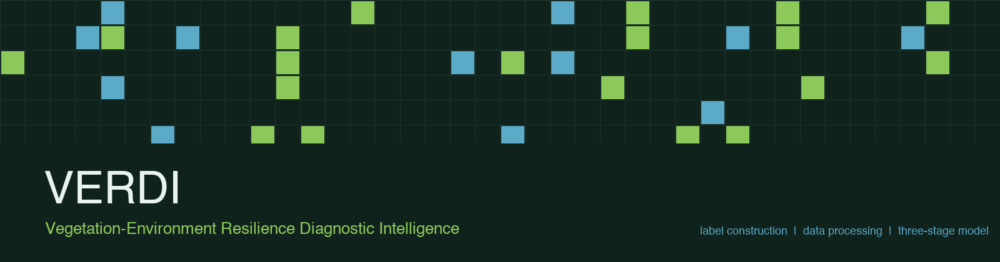
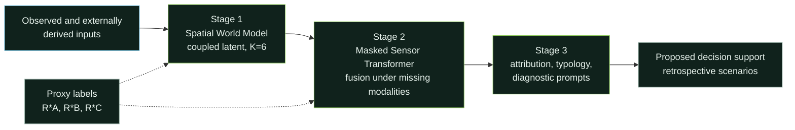

<div align="center">




**V**egetation–**E**nvironment **R**esilience **D**iagnostic **I**ntelligence —
proxy-label construction, data processing and the three-stage framework.

</div>

VERDI couples vegetation state and environmental conditions to assess three
operational, proxy-based resilience indicators for urban vegetation, and to
translate the resulting factor readouts into diagnostic narratives. The
implementation covers municipal tree censuses, Sentinel-2 and Landsat imagery,
ERA5-Land reanalysis, SMAP soil moisture and static GIS layers for three
metropolitan areas (New York City, Paris, Melbourne) on a 100 m grid.

> Code accompanying the paper *"From observation to evaluation: Coupling
> vegetation state and environmental conditions for real-time urban vegetation
> resilience assessment"* (Urban Forestry & Urban Greening).

## Contents

The label-construction and data-processing code implements Section 3.1 and
Appendix A of the paper; the Stage 1–3 model code implements Section 3.2 and
Appendix E. Stage 3 returns the diagnostic prompts. Trained weights, the
fine-tuned language model and processed city datasets are not included; see
[Data](#data).

The three labels are operational indicators of selected resilience dimensions;
they do not measure recovery, persistence, functional stability or
post-disturbance regeneration.

## Architecture



## Repository layout

| Path | Purpose |
|---|---|
| `verdi/config.py` | All parameters and their defaults |
| `verdi/labels/` | `R*_A`, `R*_B`, `R*_C` and the label-fusion strategies |
| `verdi/data/` | Census harmonisation, grid construction, exclusion rules, z-scores, spatial partitioning, output schema |
| `verdi/model/` | Stages 1–3 and their losses |
| `verdi/eval/` | Prediction, representation and calibration metrics |
| `scripts/` | Runnable entry points for the labels and the spatial split |
| `docs/` | Label definitions, data sources, processing rules, model reference |
| `tests/` | Synthetic-data checks of the formulas, the split and the model shapes |

## Proxy labels

| Label | Meaning | Built from | Availability |
|---|---|---|---|
| `R*_A` | Relative cross-environment condition | Census health and within-species NDVI and DBH percentiles | NYC, Melbourne (Paris has no census health field) |
| `R*_B` | Short-term NDVI retention around qualifying heat events | ERA5-Land daily maximum temperature, Sentinel-2 pre/post pairs | Cells with a qualifying event and a cloud-free pair |
| `R*_C` | Relative deviation from a species baseline | Sentinel-2 NDVI | All cells in all three cities; the primary reported target |

Formulas, thresholds and configurable settings are documented in
[docs/labels.md](docs/labels.md).

## Quick start

```bash
python -m venv .venv && source .venv/bin/activate
pip install -r requirements.txt

# Build the three labels on a synthetic city and write the output table
python scripts/build_labels.py --city nyc --cells 400

# Create and summarise the spatial split for a city
python scripts/make_partition.py --city melbourne

# Agreement between the labels that follows from their construction alone
python scripts/label_overlap.py --cells 4000 --seeds 5

# Run the checks
python -m pytest tests/
```

The scripts find the package from the repository root. `build_labels.py`
simulates the city, so its output exercises the plumbing and the label
formulas; replace the synthetic inputs with the provider data listed in
[docs/data_sources.md](docs/data_sources.md) to build the real tables.

## Data

Raw provider data is not distributed here. The censuses (TreesCount! 2015,
Les Arbres de Paris, Melbourne Urban Forest Visual), imagery and derived
products are obtained from their original providers under their own licences:
Sentinel-2 and Landsat are open (Copernicus, USGS public domain), ERA5-Land and
SMAP are free with attribution, SoilGrids and ESA WorldCover are CC-BY, OSM data
is ODbL, and GHSL is open. Per-variable sources, resolutions and derivations are
in [docs/data_sources.md](docs/data_sources.md); the processing rules, exclusion
criteria and partition scheme are in
[docs/processing.md](docs/processing.md).

## License

MIT — see [LICENSE](LICENSE). Provider data retains the licence of its source.
